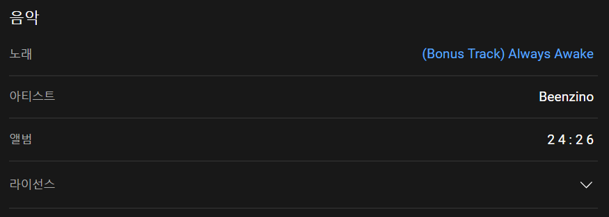

# Youtube Audio Downloader

[youtube-dl-exec](https://github.com/microlinkhq/youtube-dl-exec)를 이용한 유튜브 음원 다운로더입니다.

## 사용 예

```sh
> npm start 'https://www.youtube.com/watch?v=Pf9bPJgUsow'

[youtube] Pf9bPJgUsow: Downloading webpage
[youtube] Pf9bPJgUsow: Downloading android player API JSON
[info] Pf9bPJgUsow: Downloading 1 format(s): 140
[info] Downloading video thumbnail 41 ...
[info] Downloading video thumbnail 40 ...
[info] Downloading video thumbnail 39 ...
[info] Downloading video thumbnail 38 ...
[info] Downloading video thumbnail 37 ...
[info] Writing video thumbnail 37 to: output\Beenzino - (Bonus Track) Always Awake.webp
[download] Destination: output\Beenzino - (Bonus Track) Always Awake.m4a
[download] 100% of 3.39MiB in 00:00
[FixupM4a] Correcting container of "output\Beenzino - (Bonus Track) Always Awake.m4a"
[ThumbnailsConvertor] Converting thumbnail "output\Beenzino - (Bonus Track) Always Awake.webp" to png
[EmbedThumbnail] mutagen: Adding thumbnail to "output\Beenzino - (Bonus Track) Always Awake.m4a"
```

유튜브 영상의 설명란에 아래와 같이 노래와 아티스트에 대한 정보가 있을 시 파일명은 `${artist} - ${title}`이 되고, 그렇지 않은 경우 게시된 제목을 그대로 사용합니다.


